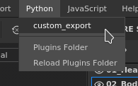
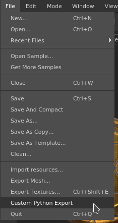

Creating a Python plugin
========================

This step by step guide describes how to create a simple Python plugin that allows to export channels of a Texture Set with a specific export preset.


## 1 - Navigate to the plugins folder

To add a new Python plugin, a simple script file can be created into the plugin folder of Substance 3D Painter.

To access the python folder, navigate to:

<table columnWidths="20,20,60">
	<tr>
		<th>Platform</th>
		<th>Version</th>
		<th>Path</th>
	</tr>
	<tr>
		<td>Windows</td>
		<td><strong>7.2</strong> or newer</td>
		<td>C:\Users\username\Documents\Adobe\Adobe Substance 3D Painter</td>
	</tr>
	<tr>
		<td></td>
		<td>Legacy</td>
		<td>C:\Users\username\Documents\Allegorithmic\Substance Painter</td>
	</tr>
	<tr>
		<td>Mac</td>
		<td><strong>7.2</strong> or newer</td>
		<td>/Users/username/Documents/Adobe/Adobe Substance 3D Painter</td>
	</tr>
	<tr>
		<td></td>
		<td>Legacy</td>
		<td>/Users/username/Documents/Allegorithmic/Substance Painter</td>
	</tr>
	<tr>
		<td>Linux</td>
		<td><strong>7.2</strong> or newer</td>
		<td>/home/username/Documents/Adobe/Adobe Substance 3D Painter</td>
	</tr>
	<tr>
		<td></td>
		<td>Legacy</td>
		<td>/home/username/Documents/Allegorithmic/Substance Painter</td>
	</tr>
</table>

> **Note**: The folder "**plugins**" is for Javascript plugins. Python plugins need to go under the "**python/plugins**" folder.

## 2 - Creating the new plugin file

At the root of the plugin folder, create a new text file and give it the name of **custom_export.py**.

## 3 - Script content

Open the empty script file into a text editor and paste the following code snippet. Take a look at the code comments for more details on its behavior.

```python
import os

# Substance 3D Painter modules
import substance_painter.ui
import substance_painter.export
import substance_painter.project
import substance_painter.textureset

# PySide module to build custom UI
from PySide2 import QtWidgets

plugin_widgets = []


def export_textures() :
	# Verify if a project is open before trying to export something
	if not substance_painter.project.is_open() :
		return

	# Get the currently active layer stack (paintable)
	stack = substance_painter.textureset.get_active_stack()

	# Get the parent Texture Set of this layer stack
	material = stack.material()

	# Build Export Preset resource URL
	# - Context: name of the library where the resource is located
	# - Name: name of the resource (filename without extension or Substance graph path)
	export_preset = substance_painter.resource.ResourceID(
		context="starter_assets",
		name="PBR Metallic Roughness" )

	print( "Preset:" )
	print( export_preset.url() )

	# Setup the export settings
	resolution = material.get_resolution()

	# Setup the export path, in this case the textures
	# will be put next to the spp project file on the disk
	Path = substance_painter.project.file_path()
	Path = os.path.dirname(Path) + "/"

	# Build the configuration
	config = {
		"exportShaderParams"  : False,
		"exportPath" : Path,
		"exportList" : [ { "rootPath" : str(stack) } ],
		"exportPresets" : [ { "name" : "default", "maps" : [] } ],
		"defaultExportPreset" : export_preset.url(),
		"exportParameters" : [
			{
				"parameters" : { "paddingAlgorithm": "infinite" }
			}
		]
	}

	substance_painter.export.export_project_textures( config )


def start_plugin():
	# Create a text widget for a menu
	Action = QtWidgets.QAction("Custom Python Export",
			triggered=export_textures)

	# Add this widget to the existing File menu of the application
	substance_painter.ui.add_action(
	substance_painter.ui.ApplicationMenu.File,
	Action )

	# Store the widget for proper cleanup later when stopping the plugin
	plugin_widgets.append(Action)


def close_plugin():
	# Remove all widgets that have been added to the UI
	for widget in plugin_widgets:
	substance_painter.ui.delete_ui_element(widget)

	plugin_widgets.clear()


if __name__ == "__main__":
	start_plugin()
```

## 4 - Loading and enabling the plugin

Launch Substance 3D Painter to make the application discover the plugin.

Click on the Python menu and then click on the plugin name to enable it:



Finally click on the File menu and select Custom Python Export to trigger the export function of the script:

